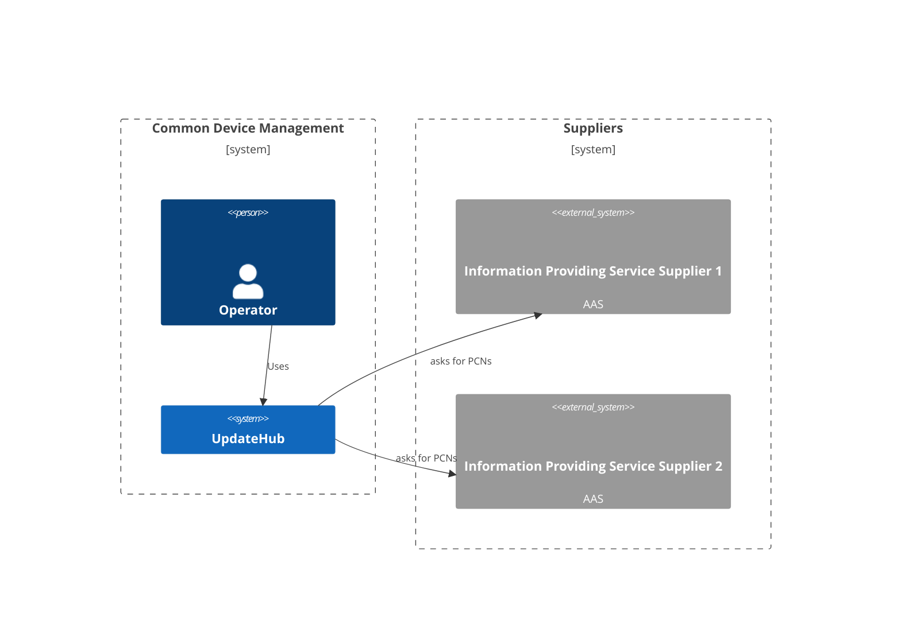
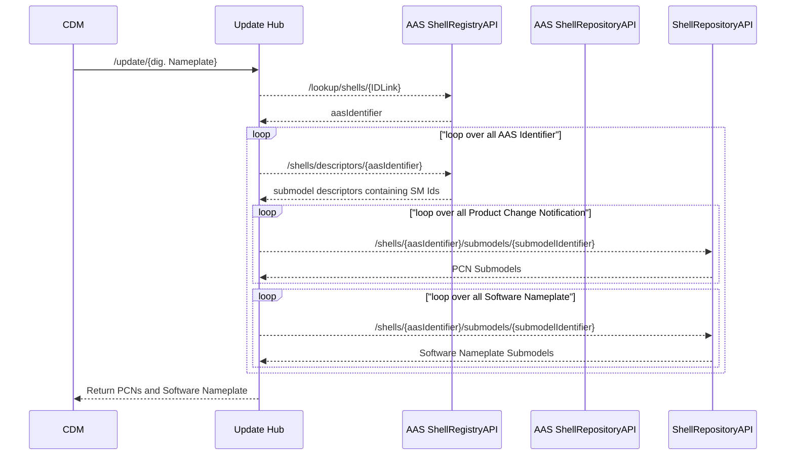

# UpdateHub

Service requesting information from downstream services for a given asset.



## Build && Run && Test

```bash
# Run the service locally and serving the endpoint on
# http://localhost:8080/swagger/
$ cd UpdateWHub/ dotnet run
```

Or as container:

```bash
# Please place a valid config.yaml file in the same directory.
# This exposes port 5292 (Dev version) and 8000 (Prod version)
$ docker run -p 8000:8080 -p 5292:8080 -v ./config.yaml:/app/config.yaml ghcr.io/industrial-asset-hub/irs:latest
```

For a brief smoketest, a [hurl](https://hurl.dev) file is included.

> This test is not exhaustive and only checks if the service is running and responding.
> In addition, it checks if given IdLinks for _real_ AAS servers are working.

```
$ hurl UpdateHub/tests.hurl --test
UpdateHub/tests.hurl: Running [1/1]
```

## Process view



## Deployment view

### Static view

As of now, this service is being build as one docker image.

### Configuration file

The servers configuration is stored inside an YAML file. The location of the file
can be set using the `CONFIG_FILE_PATH` environment variable.

The following example shows the configuration for three different AAS servers, with different
authentication methods.

```yaml
aas-servers:
  - name: SampleAasServerOAuth2
    id-link-prefix: https://sample-company-1.com/
    url: https://sample-company-1.com/aas
    auth:
      auth-type: oauth2
      client-id: your-client-id
      client-secret: your-client-secret
      token-url: https://sample-company-1.com/auth/realms/realm1/protocol/openid-connect/token

  - name: SampleAasServerApiKey
    id-link-prefix: https://sample-company-2.com/
    url: https://sample-company-1.com/products/aas
    auth:
      auth-type: apikey
      api-key: your-api-key

  - name: SampleAasServerBearerToken
    id-link-prefix: https://sample-company-2.com/
    url: https://sample-company-1.com/products/aas
    auth:
      auth-type: bearertoken
      bearer-token: your-bearer-token
```

### Environment Variables

| Variable              | Description                        | Default     |
| --------------------- | ---------------------------------- | ----------- |
| CONFIG_FILE_PATH      | Path to the configuration file     | config.yaml |
| ENABLE_METRIC         | Enable prometheus metrics endpoint | false       |
| OTLP_ENDPOINT_URL     | OpenTelemetry exporter endpoint    | null        |
| OTEL_CONSOLE_EXPORTER | Enable console exporter            | false       |
