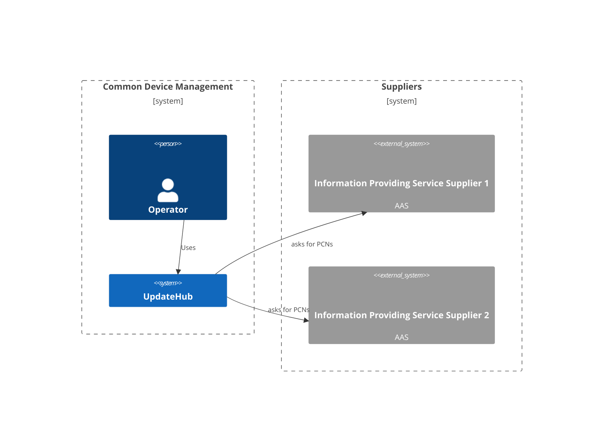
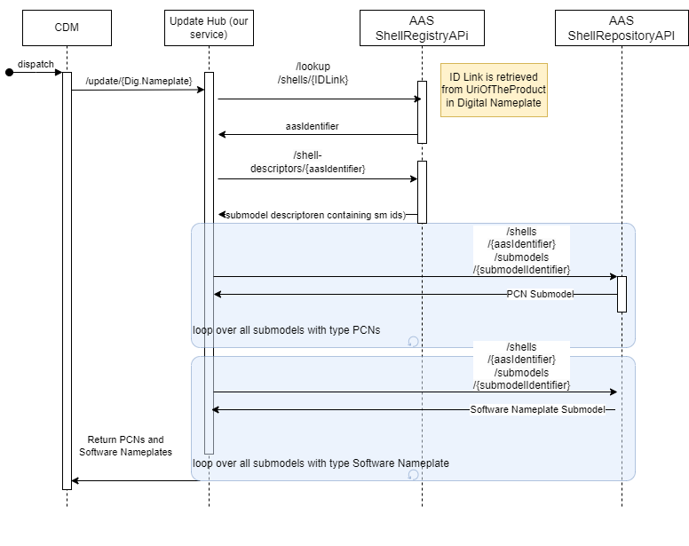

# UpdateHub

Service requesting information from downstream services for a given asset.



## Build && Run && Test

```bash
# Run the service locally and serving the endpoint on
# http://localhost:8080/swagger/
$ cd UpdateWHub/ dotnet run
```

## Process view



## Deployment view

### Static view
As of now, this service is being build as one docker image. This image is hosted on ECS in the AWS CDM Dev account.


### Dynamic view

#### Update of the service:
With every commit, regardless of branch, a new image is being build, stored and deployed.<br>
 * all images are stored in the Github container registry ghcr.io
 * with every commit a new ECS task definition is being deployed, holding exactly the SHA of the image that was being built
 * ECS has access to the AWS secret manager using a PAT for Github to pull the image

 

 ### Update of the infrastructure:
 The infrastructure tofu state file is stored in S3. OIDC allows the Github actions to modify the AWS resources.<br>
  * A tofu plan step is being executed with every change in the tofu folder
  * tofu apply is only being executed on main

### Environment variables

The service requires the following environment variables to be set:

| Variable          | Description                                            |
|-------------------|--------------------------------------------------------|
| SICK_CLIENTID     | Sick Client ID                                         |
| SICK_CLIENTSECRET | Sick Client Secret                                     |
| FESTO_BEARER      | Festo API Key                                          |
