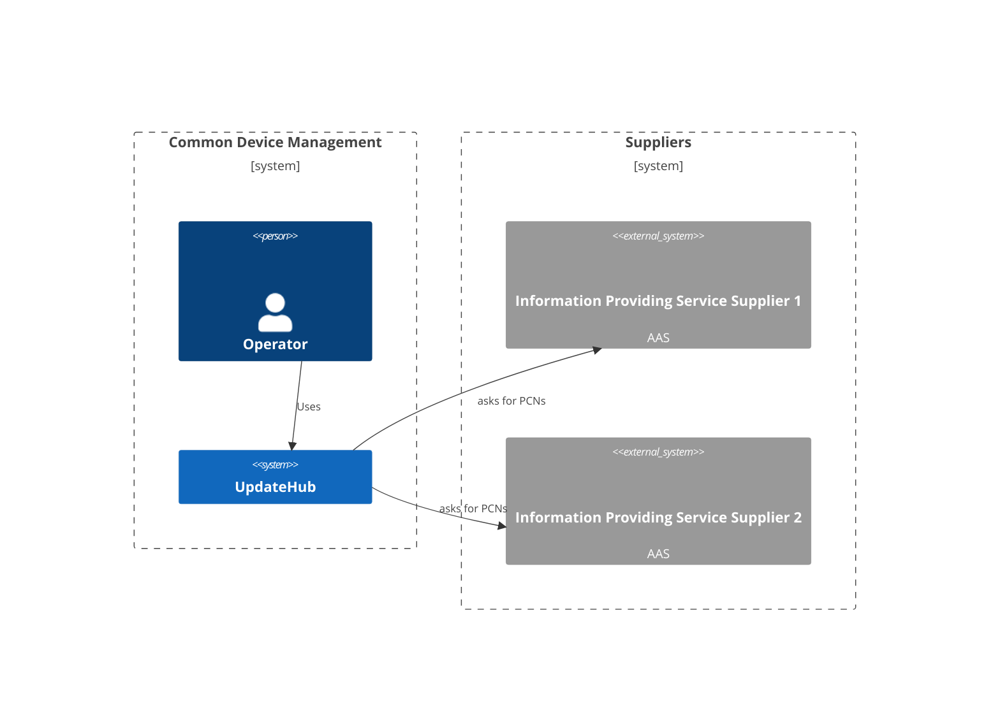
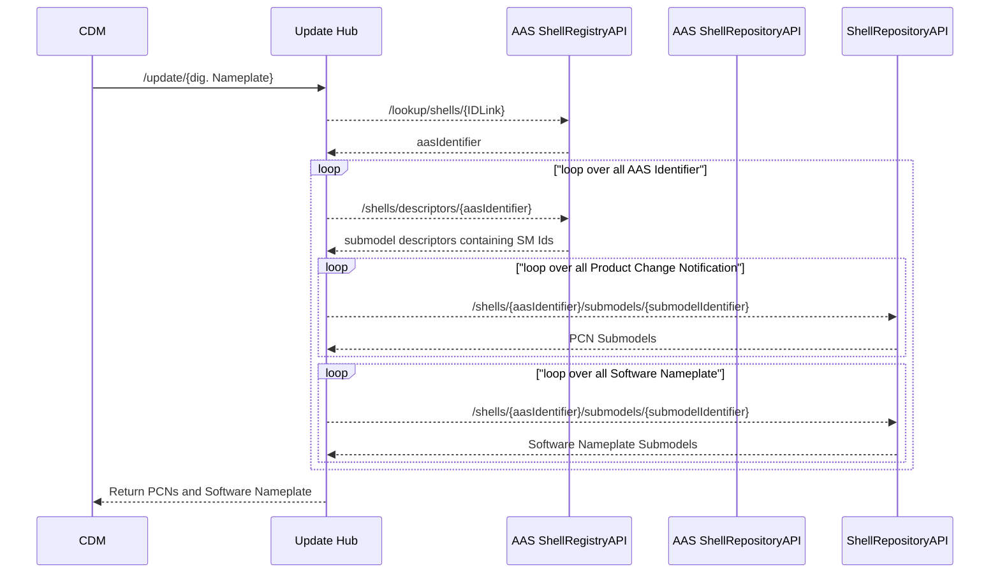

# UpdateHub

Service requesting information from downstream services for a given asset.



## Build && Run && Test

```bash
# Run the service locally and serving the endpoint on
# http://localhost:8080/swagger/
$ cd UpdateWHub/ dotnet run
```

## Process view



## Deployment view

### Static view
As of now, this service is being build as one docker image. This image is hosted on ECS in the AWS CDM Dev account.

### Dynamic view

#### Update of the service:
With every commit, regardless of branch, a new image is being build, stored and deployed.<br>
 * all images are stored in the Github container registry ghcr.io

### Configuration file

The servers configuration is stored inside an YAML file. The location of the file
can be set using the `CONFIG_FILE_PATH` environment variable.

The following example shows the configuration for three different AAS servers, with different
authentication methods.
```yaml
aas-servers:
- name: SampleAasServerOAuth2
  id-link-prefix: https://sample-company-1.com/
  url: https://sample-company-1.com/aas
  auth:
    auth-type: oauth2
    client-id: your-client-id
    client-secret: your-client-secret
    token-url: https://sample-company-1.com/auth/realms/realm1/protocol/openid-connect/token

- name: SampleAasServerApiKey
  id-link-prefix: https://sample-company-2.com/
  url: https://sample-company-1.com/products/aas
  auth:
    auth-type: apikey
    api-key: your-api-key

- name: SampleAasServerBearerToken
  id-link-prefix: https://sample-company-2.com/
  url: https://sample-company-1.com/products/aas
  auth:
    auth-type: bearertoken
    bearer-token: your-bearer-token
```
