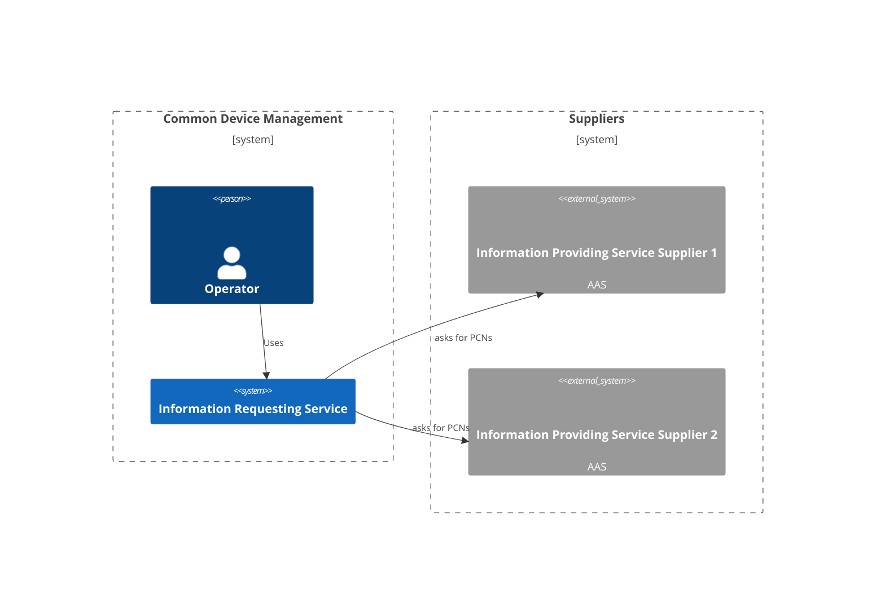

# Information Requesting Service

Service requesting information from downstream services for a given asset.



## Build && Run && Test

```bash
# Run the service locally and serving the endpoint on
# http://localhost:8080/swagger/
$ cd irs/ dotnet run
```
